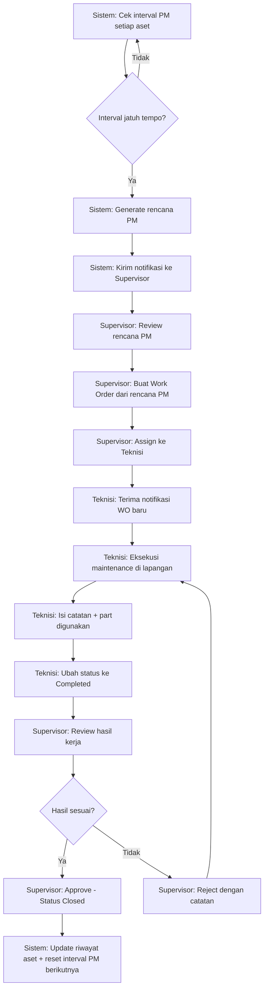
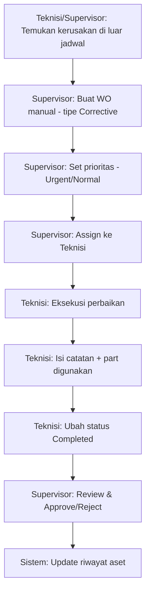
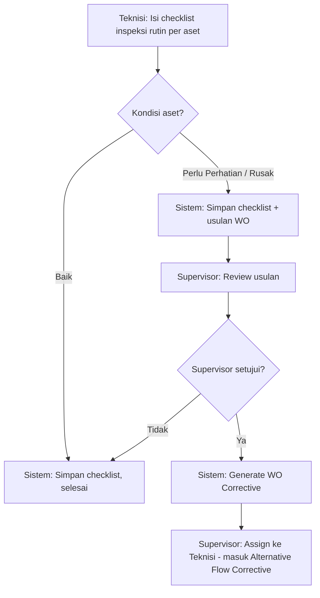
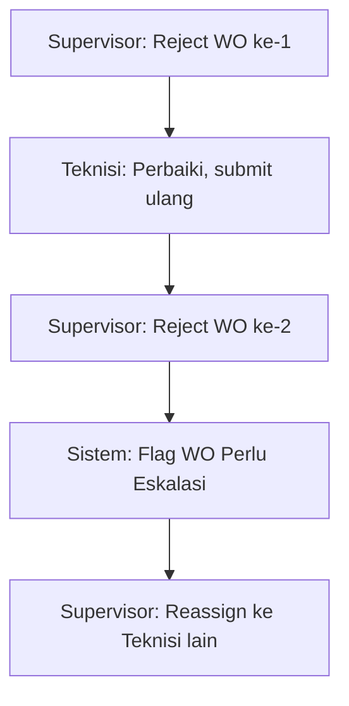

# Business Process

## 1. Main Workflow: Preventive Maintenance (PM) Terjadwal

## 2. Alternative Flow: Corrective Maintenance (Kerusakan Mendadak)

## 3. Alternative Flow: Inspeksi → Work Order (revisi final)

Semua usulan WO dari checklist inspeksi (baik minor "perlu perhatian" maupun major "rusak") wajib dikonfirmasi Supervisor — Teknisi tidak bisa membuat WO sendiri (lihat ADR-004).

## 4. Exception Flow: Work Order Ditolak Berulang (Eskalasi)

Threshold eskalasi = 2x reject berturut-turut. Eskalasi ditangani sesama Supervisor (reassign), Plant Manager tidak terlibat proses operasional (lihat ADR-004).

## 5. Approval Flow: Ringkasan Titik Approval

| Titik Approval | Siapa | Aksi |
|---|---|---|
| Rencana PM → Work Order | Supervisor | Approve rencana jadi WO resmi |
| WO Completed → Closed | Supervisor | Approve/Reject hasil kerja Teknisi |
| Temuan Inspeksi → WO baru | Supervisor | Konfirmasi pembuatan WO dari temuan |
| WO Eskalasi (reject 2x) | Sesama Supervisor | Reassign ke Teknisi lain |
