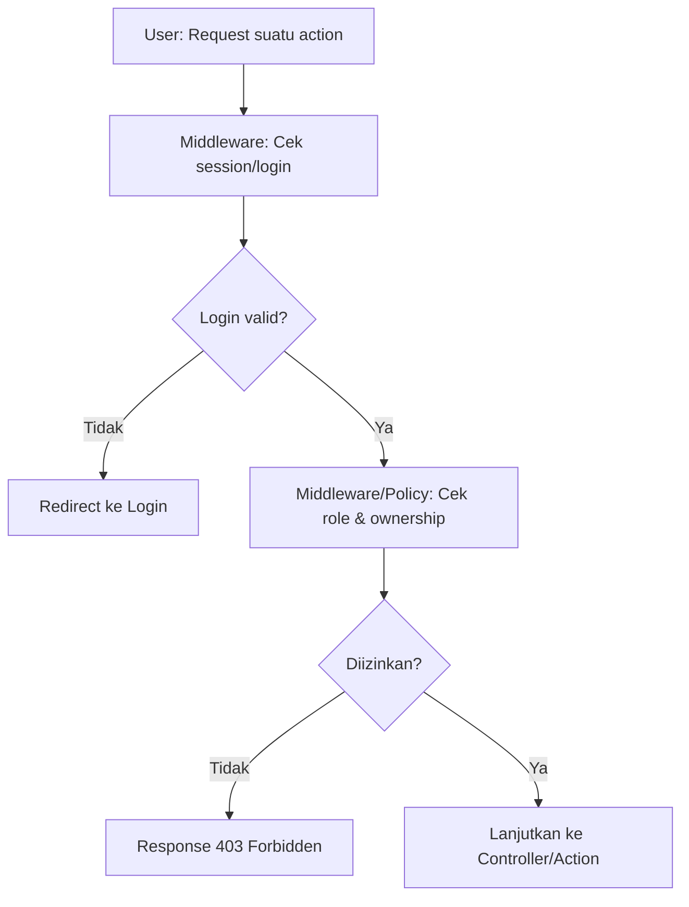
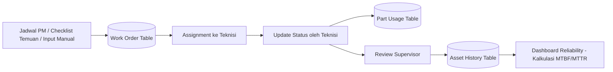

# System Flow

## A. Authentication Flow

```mermaid
flowchart TD
    A[User: Buka halaman login] --> B[User: Input email + password]
    B --> C[Sistem: Validasi kredensial]
    C --> D{Valid?}
    D -- Tidak --> E[Sistem: Tampilkan error, hitung percobaan gagal]
    D -- Ya --> F[Sistem: Buat session + tentukan role]
    F --> G{Role?}
    G -- Admin --> H[Redirect ke Admin Dashboard]
    G -- Supervisor --> I[Redirect ke Supervisor Dashboard]
    G -- Teknisi --> J[Redirect ke Teknisi Task List]
    G -- Plant Manager --> K[Redirect ke Executive Dashboard]
```

Percobaan login gagal berulang (misal 5x) di-throttle sementara (rate limiting) — fitur bawaan Laravel `RateLimiter`.

## B. Authorization Flow (setiap request)

Ini mengimplementasikan RBAC secara teknis — setiap action (bukan cuma halaman) dicek lewat Policy Laravel.

## C. Data Flow: Siklus Work Order

## D. Notification Flow (in-app saja untuk MVP — lihat ADR)

| Trigger | Penerima | Jenis |
|---|---|---|
| PM jatuh tempo | Supervisor | In-app notification |
| WO baru di-assign | Teknisi | In-app notification |
| WO direject | Teknisi | In-app notification + catatan alasan |
| WO perlu eskalasi (2x reject) | Semua Supervisor | In-app notification |

Email notification ditunda sebagai future development (Should Have).
