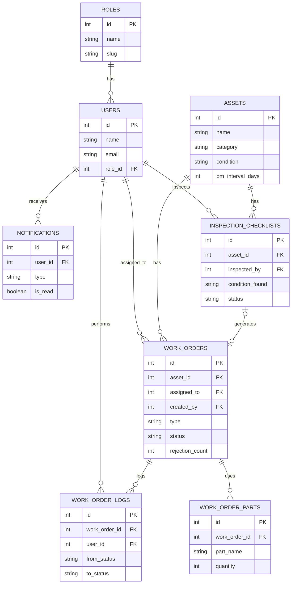

# ERD (Entity Relationship Diagram)

## Daftar Entity

### 1. roles
Master data role (Admin, Supervisor, Teknisi, Plant Manager) — tabel terpisah (bukan enum) supaya permission fleksibel diatur tanpa migrasi ulang.
- PK: id
- Atribut: name, slug

### 2. users
Seluruh akun pengguna sistem.
- PK: id
- FK: role_id → roles.id
- Atribut: name, email (unique), password, created_at, updated_at, deleted_at (soft delete)
- Relationship: 1 role punya banyak users

### 3. assets
Registry aset kritis (turbin, sumur, pipa, cooling tower).
- PK: id
- Atribut: name, category, location, installed_at, condition, pm_interval_days, last_pm_at, status, deleted_at (soft delete)
- Relationship: 1 asset punya banyak work_orders, banyak inspection_checklists

### 4. work_orders
Entitas inti — siklus hidup maintenance.
- PK: id
- FK: asset_id, assigned_to (user_id/Teknisi), created_by (user_id/Supervisor), approved_by (user_id, nullable)
- Atribut: type (preventive/corrective), priority, status, description, rejection_count, rejection_note, scheduled_at, completed_at, closed_at
- Relationship: 1 WO punya banyak work_order_parts, banyak work_order_logs

### 5. work_order_parts
Catatan part yang dipakai per WO.
- PK: id
- FK: work_order_id (ON DELETE CASCADE)
- Atribut: part_name, quantity, unit

### 6. work_order_logs
Audit trail — histori perubahan status WO (append-only, tidak pernah di-update/delete).
- PK: id
- FK: work_order_id, user_id
- Atribut: from_status, to_status, note, created_at

### 7. inspection_checklists
Checklist inspeksi per aset.
- PK: id
- FK: asset_id, inspected_by (user_id/Teknisi), reviewed_by (user_id/Supervisor, nullable), generated_work_order_id (nullable)
- Atribut: condition_found, notes, status

### 8. notifications
Notifikasi in-app.
- PK: id
- FK: user_id (penerima), related_work_order_id (nullable)
- Atribut: type, message, is_read

## Relationship Summary (Cardinality)

| Relasi | Cardinality |
|---|---|
| roles → users | 1 to many |
| assets → work_orders | 1 to many |
| users (Teknisi) → work_orders (assigned_to) | 1 to many |
| users (Supervisor) → work_orders (created_by/approved_by) | 1 to many |
| work_orders → work_order_parts | 1 to many |
| work_orders → work_order_logs | 1 to many |
| assets → inspection_checklists | 1 to many |
| inspection_checklists → work_orders (generated_work_order_id) | 1 to 0..1 (opsional) |
| users → notifications | 1 to many |

## Diagram

## Keputusan Kunci

- **Soft delete** hanya di `users` dan `assets` (data master yang perlu ditelusuri historinya).
- **`roles` sebagai tabel terpisah** (bukan enum di kolom users.role) untuk scalability — mudah tambah role baru tanpa migrasi ulang skema.
